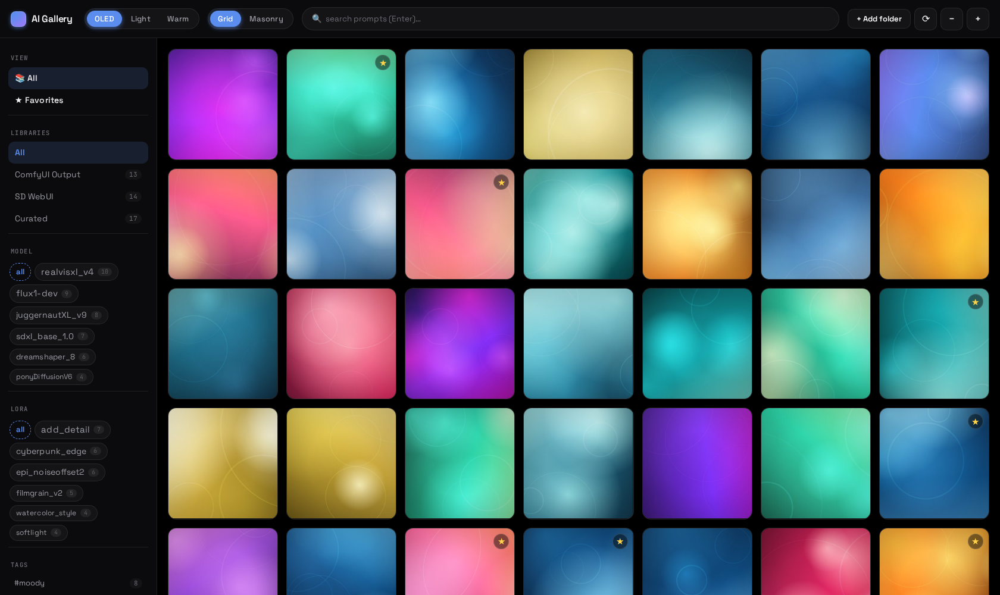
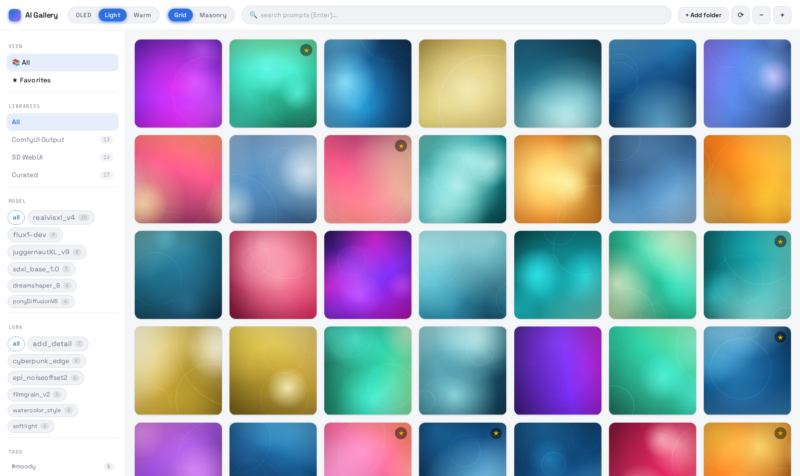
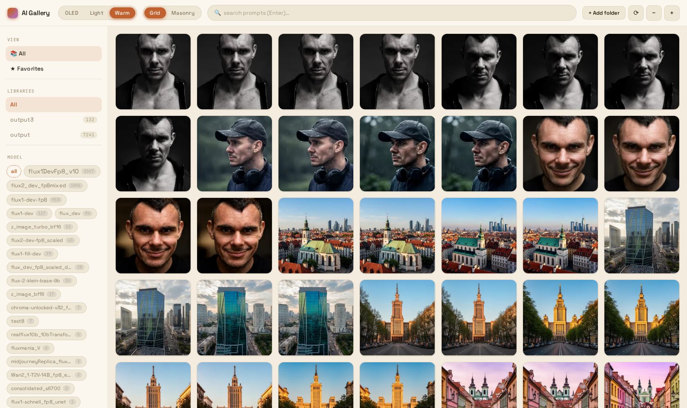
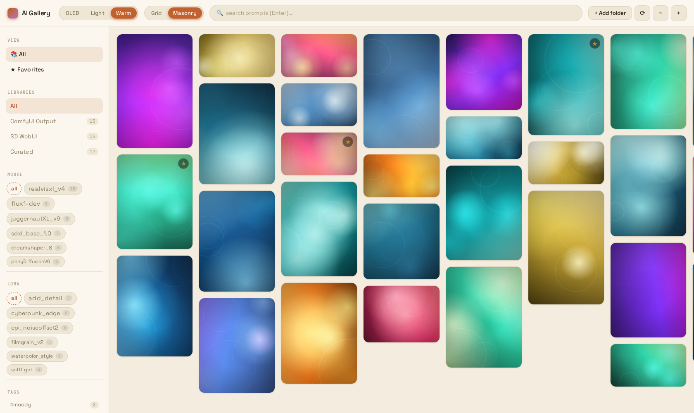
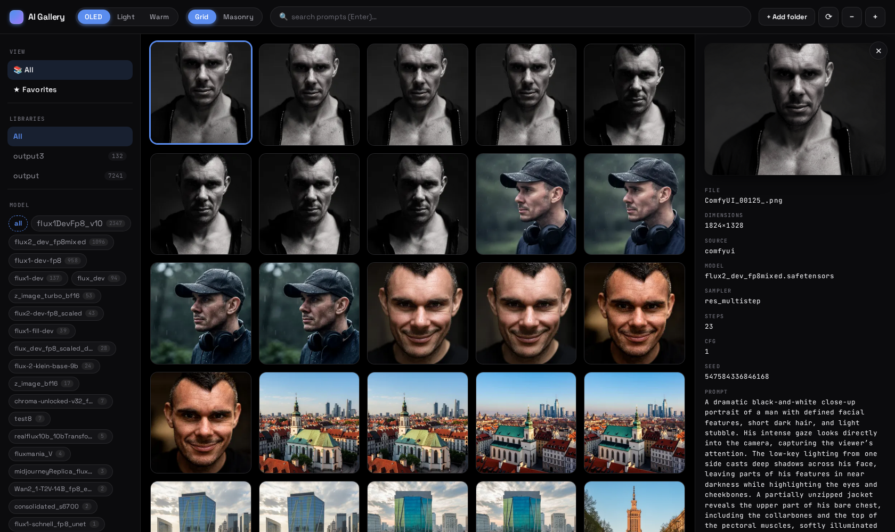
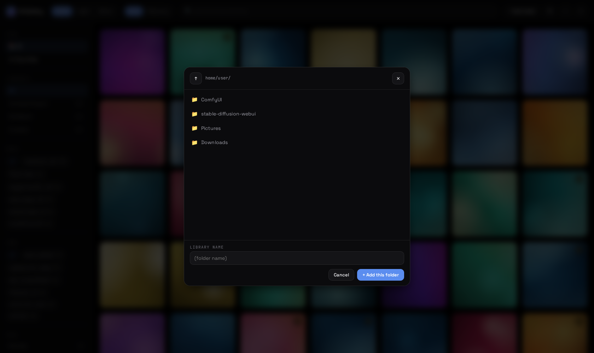
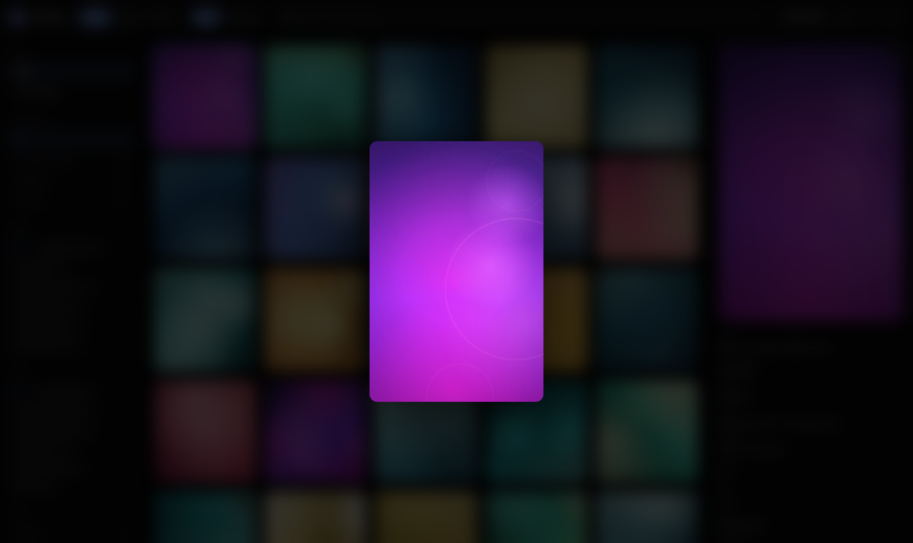

# AI Gallery

A local, single-user web app for browsing libraries of AI-generated images
(ComfyUI / A1111 / Stable Diffusion). Recursively scans the folders you point
it at, parses prompts and generation parameters from PNG/JPG metadata, and
indexes everything in SQLite with full-text search. Reacts to file changes
live via `watchdog` and `WebSocket`.

Built with FastAPI on the backend and vanilla JavaScript on the frontend — no
build step, no Node toolchain, no Docker.



Three built-in themes (OLED · Light · Warm) and a grid ⇄ masonry view toggle,
both switchable from the top bar.

## Features

- **Multiple libraries.** Add as many source folders as you want; they're
  scanned recursively. Switch between them or view everything at once.
- **AI metadata extraction.** Parses PNG `tEXt` chunks (ComfyUI `workflow` +
  `prompt`, A1111 `parameters`) and JPG EXIF `UserComment`. Extracts prompt,
  negative prompt, model, sampler, steps, CFG, seed and LoRAs.
- **First-class companion plugin.** Pair with
  [`comfyui-save-image-rich-metadata`](https://github.com/quzopl/comfyui-save-image-rich-metadata)
  in ComfyUI to embed clean, authoritative metadata in every render — no
  guessing required.
- **Full-text search.** SQLite FTS5 over prompts. Hit Enter, get results.
- **Facet filters.** Cloud-style chips for models and LoRAs with proportional
  font sizing by frequency. Custom suffix stripping (`.safetensors`, `.ckpt`,
  `.gguf` etc.) for readable labels.
- **Custom tags.** Add arbitrary tags per image, filter by multi-select
  (AND across tags). No tag taxonomy — make up what you need.
- **Favorites.** Star any image; quick toggle between "All" and "Favorites"
  in the sidebar.
- **Live updates.** A watchdog observer per library detects new / changed /
  deleted files within ~500 ms and pushes updates over WebSocket. New images
  appear without a manual refresh.
- **Safe file operations.** Delete (to XDG Trash, restorable from Plasma's
  Trash), rename (in-place, validated), move. Every write is audit-logged.
- **Virtual grid.** Lazy-loaded thumbnails with `IntersectionObserver`.
  Cursor-based pagination handles tens of thousands of images.
- **Cached thumbnails.** WebP, generated on first request, keyed by SHA1.
  Orphans swept on startup and rescan.
- **Keyboard-first.** Slash to search, arrows to navigate, Esc to close.

## Screenshots

### Themes

| OLED (default) | Light | Warm |
|---|---|---|
|  |  |  |

### Views

| Grid (square, default) | Masonry (preserves aspect ratio) |
|---|---|
|  |  |

### Panels

| Detail panel | Folder picker | Lightbox |
|---|---|---|
|  |  |  |

## Quick start

Requirements:

- Linux
- [`uv`](https://docs.astral.sh/uv/) (manages Python 3.12 + dependencies)

```bash
git clone https://github.com/quzopl/ai-gallery.git
cd ai-gallery
./run.sh
```

Then open <http://127.0.0.1:8923>. Override the port via `PORT=9000 ./run.sh`.

Click **+ Add folder**, point it at a directory of AI-generated PNGs/JPGs, and
the gallery populates as the scan runs.

> **Want to try it without any data?** Open <http://127.0.0.1:8923/demo.html>
> instead — it ships with a tiny mock backend (procedural thumbnails, fake
> filesystem, sample images) so every feature works in isolation. Useful for
> evaluating the UI before pointing it at your own collection.

## Usage

### Adding libraries

Click **+ Add folder**. A modal browser opens at your home directory; click
folders to navigate, click **+ Add this folder** to confirm. The library is
scanned recursively in the background and a `watchdog` observer keeps it
synced with the filesystem.

### Searching

The top search box is wired to SQLite FTS5 over the `prompt`, `negative` and
`model_name` columns. Press Enter to apply, clear the box and Enter to reset.

### Filtering

The sidebar has facets for:

- **View** — quickly switch between All and Favorites.
- **Libraries** — narrow to one library or show everything.
- **Model / LoRA** — cloud of chips, font-sized by frequency. Click to filter,
  click again to clear.
- **Tags** — your custom tags. Multi-select; images must have *all* selected
  tags (AND).

### Detail panel

Clicking a thumbnail opens the right panel with the full image, all
extracted metadata, and the tag chips for that image. Type a tag name + Enter
in the **+ add tag** field to add. Click the `×` on a chip to remove.

Buttons:

- **☆ Favorite** — toggle favorite (also shown as a gold star on the tile)
- **📋 Copy prompt** — to clipboard
- **🗑 Move to trash** — to XDG Trash (restorable from your file manager)
- **✎ Rename** — in-place, validated

Click the image to open the full-screen lightbox; click anywhere to close it.

### Keyboard shortcuts

| Key | Action |
|---|---|
| `/` | Focus search |
| `Esc` | Close lightbox / detail panel / picker (in that priority) |
| `←` `→` | Previous / next image |
| `Del` | Move selected image to trash (with confirm) |
| `Ctrl+C` | Copy prompt of selected image |
| `Ctrl+-` / `Ctrl+=` | Smaller / larger tiles |

Tile size, last selected library, etc. are persisted in `localStorage`.

## How metadata extraction works

For each scanned image the parser tries in priority order:

1. **`ai_gallery_meta` tEXt chunk** — written by the
   [companion plugin](https://github.com/quzopl/comfyui-save-image-rich-metadata).
   Authoritative, no heuristics needed.
2. **ComfyUI `prompt` / `workflow` chunks** — the execution graph is parsed
   by tracing the sampler's positive/negative links back to their text:
   through `CLIPTextEncode` / `CLIPTextEncodeFlux`, string primitives,
   `PreviewAny`, boolean switches (ComfySwitchNode, Crystools, rgthree Any
   Switch), `Text Concatenate`, `CR Prompt Text`, `SDXLPromptStyler`,
   `ImpactWildcardEncode`, Qwen image-edit encoders, LTXV/Wan conditioning
   nodes, and the cached output of `ShowText` when the text came from an
   LLM/VLM node. If no link can be traced, the best literal string in the
   graph is used. Sampler params come from `KSampler*` or the
   `RandomNoise` / `BasicScheduler` / `*Guider` / `KSamplerSelect` helpers
   (links to primitive/seed nodes are followed); model from
   `CheckpointLoader*` / `UNETLoader`; LoRAs from `LoraLoader*`, rgthree
   Power Lora Loader / Lora Loader Stack, CR LoRA Stack and
   `LoraLoaderStackedAdvanced` (only enabled entries).
3. **A1111 `parameters` chunk** — the standard webUI format with positive
   prompt + `Negative prompt:` line + `Steps: ..., Sampler: ..., ...`. LoRAs
   are extracted from inline `<lora:name:strength>` tags.
4. **EXIF `UserComment` (tag 0x9286)** — A1111's JPG format with UTF-16-BE
   payload after an 8-byte charset header.

If nothing matches, the image is still indexed (filename, size, dimensions),
just without the AI fields.

For the most reliable extraction, **install the companion ComfyUI plugin**
and replace `SaveImage` with `Save Image (AI Gallery)` in your workflows.
The plugin traces the actual KSampler→CLIPTextEncode link instead of
guessing, supports `Power Lora Loader (rgthree)` slot dicts, and writes
A1111-compatible `parameters` as a bonus.

## File operations

- **Delete** moves the file to your **XDG Trash**
  (`~/.local/share/Trash/`). It's restorable from Dolphin / Nautilus /
  any standard file manager.
- **Rename** uses `os.rename` (atomic within the same partition). The new
  name is validated against path separators and `..` segments.
- **Move** uses `shutil.move` and validates that the destination is within
  one of your tracked libraries.
- Every successful or failed operation is recorded in the `file_ops` table.
  Endpoint `GET /api/audit` returns the last N entries.

## Architecture

Single `uvicorn` process. Inside it:

- **FastAPI** event loop handles HTTP + WebSocket.
- **Per-library `watchdog.Observer`** runs in a daemon thread, debounced
  500 ms (so a flurry of partial writes during ComfyUI saves is collapsed).
- **`ThreadPoolExecutor`** (4–8 workers) parses metadata on initial scan.
- **Single SQLite writer thread** with a `queue.Queue` mailbox. All writes
  go through it so observers and HTTP handlers never fight for the write
  lock. Reads use independent connections in any thread.

Schema (SQLite with WAL):

- `libraries(id, path, name, added_at, last_scan_at)`
- `images(id, library_id, rel_path, sha1, mtime, size, width, height,
  source_kind, prompt, negative, model_name, sampler, steps, cfg, seed,
  is_favorite, raw_metadata, indexed_at)`
- `loras(id, name)`, `image_loras(image_id, lora_id, strength)`
- `tags(id, name)`, `image_tags(image_id, tag_id)`
- `images_fts` — FTS5 virtual table over prompt/negative/model_name with
  triggers to stay in sync
- `file_ops(id, ts, op, library_id, from_path, to_path, success, error)` —
  audit log

## API

| Method | Path | Notes |
|---|---|---|
| `GET` | `/api/libraries` | List with image counts |
| `POST` | `/api/libraries` | `{path, name?}` — starts scan + observer |
| `DELETE` | `/api/libraries/{id}` | Removes from DB (files untouched) |
| `POST` | `/api/libraries/{id}/rescan` | Full rescan; `?force=true` re-parses metadata of unchanged files too (Shift+click ⟳ in the UI) |
| `GET` | `/api/browse?path=...` | Server-side directory listing for the picker |
| `GET` | `/api/images` | `?library_id=&model=&lora=&q=&favorite=&tag=&sort=&cursor=&limit=` |
| `GET` | `/api/images/{id}` | Full metadata including LoRAs and tags |
| `GET` | `/api/images/{id}/thumb` | WebP thumbnail (immutable cache) |
| `GET` | `/api/images/{id}/file` | Original file |
| `DELETE` | `/api/images/{id}` | Move to XDG Trash |
| `POST` | `/api/images/{id}/rename` | `{new_name}` |
| `POST` | `/api/images/{id}/move` | `{to_library_id, to_rel_path}` |
| `POST` | `/api/images/{id}/favorite` | `{value: bool}` |
| `POST` | `/api/images/{id}/tags` | `{tags: [str]}` — replaces all tags |
| `GET` | `/api/tags` | All tags with counts |
| `DELETE` | `/api/tags/{id}` | Delete a tag globally |
| `GET` | `/api/facets` | `{models, loras}` for sidebar |
| `GET` | `/api/audit` | Last N file operations |
| `WS` | `/ws` | Broadcast: `scan_progress`, `scan_done`, `image_added/removed/changed` |

Pagination is cursor-based; the cursor is a base64-encoded `mtime|id` tuple.

## Configuration

Environment variables:

- `PORT` — HTTP port (default `8923`)
- `AI_GALLERY_WORK_DIR` — where the SQLite DB and thumbnail cache live
  (default: `.work/` inside the project)
- `XDG_DATA_HOME` — XDG base dir for the trash (standard)

## Development

```bash
./.venv/bin/pytest                       # 38 tests, ~4 s
./run.sh                                  # uvicorn --reload
```

Tech stack:

- Python 3.12 (managed by `uv`)
- FastAPI + `uvicorn[standard]`
- Pillow, watchdog
- SQLite + FTS5 (stdlib)
- Vanilla JavaScript, no build step

See `docs/superpowers/specs/` for the original design doc and
`docs/superpowers/plans/` for the implementation plan.

## Companion plugin

[**comfyui-save-image-rich-metadata**](https://github.com/quzopl/comfyui-save-image-rich-metadata)
(node: **Save Image (Rich Metadata)**) is a tiny ComfyUI custom node that
writes clean, authoritative metadata into every saved image. Highly
recommended if you use ComfyUI — it eliminates the heuristic guesswork
involved in tracing prompts and LoRAs out of arbitrary execution graphs.

## License

MIT
